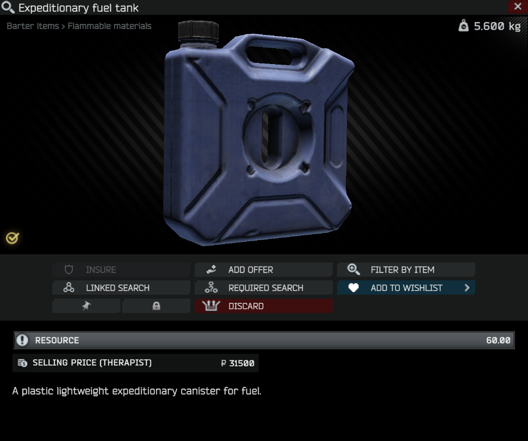
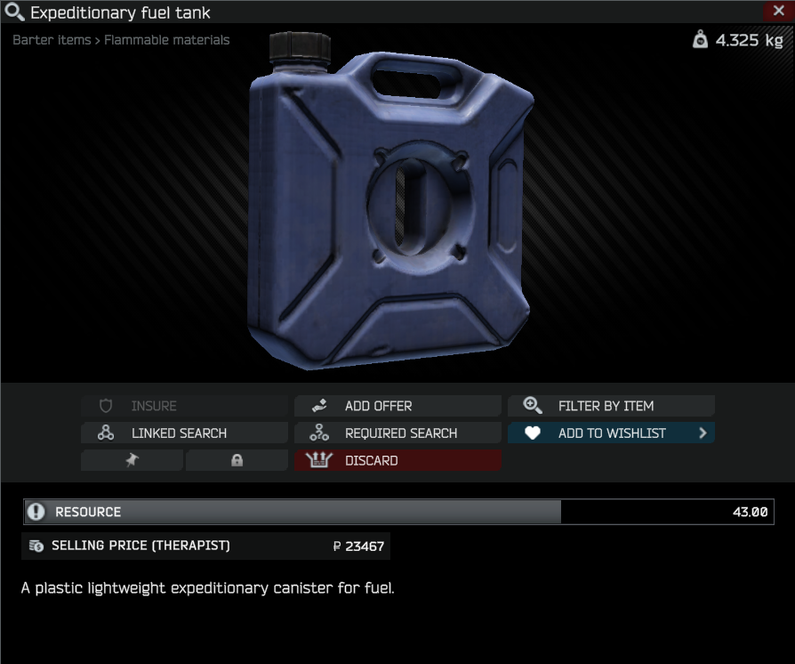

# Dynamic Item Weights

## 📜 Description

**Dynamic Item Weights** is a plugin for *Single Player Tarkov* that adjusts the weight of items based on their current usage.

## ✨ Features

* Adjusts weight for items dynamically based on remaining resources
* In-game configuration settings for fine-tuning
* Empty weights fully configurable via `emptyweights.json`

## 📁 Installation

* Download the latest release
* Copy the `BepInEx` folder into your SPT folder
* Start the game

## 🛠️ Configuration

### In-game menu

* **Enable Plugin**: Toggle dynamic item weights on/off
* **Default Empty Fraction**: Fallback empty weight as a fraction of the full item weight

### emptyweights.json

A JSON file mapping the item template ID to the empty weight in kilograms
```json
{
    "57513f07245977207e26a311": 0.030, // Apple
    "5d1b36a186f7742523398433": 2.500  // Fuel (Metal)
}
```
> If an item is missing, the plugin uses `Default Empty Fraction` of the original weight

## ℹ️ Supported Items

* Medical items (`MedKitComponent`)
* Food & Drinks (`FoodDrinkComponent`)
* Fuel (`FuelItemClass` with `ResourceComponent`)
* Repair Kits (`RepairKitComponent`)
> Check `emptyweights.json` for an extensive list

## 📷 Preview


<br/>


## 📄 License

Distributed under the MIT License. See `LICENSE` for more information.
